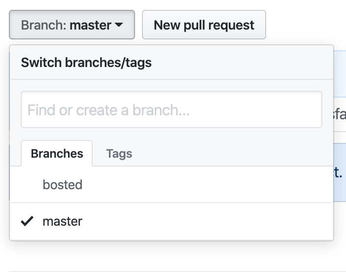
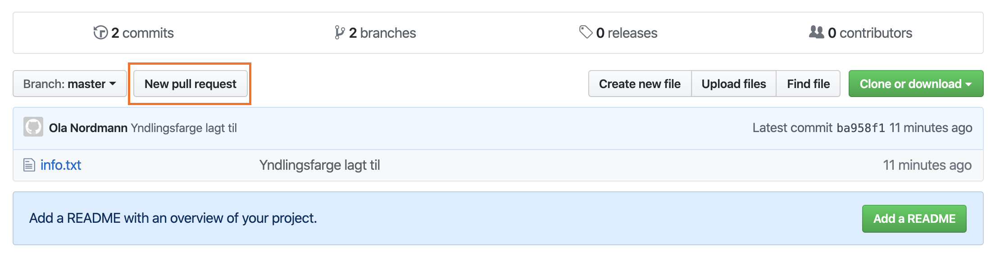
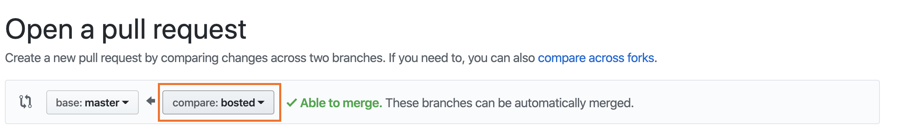
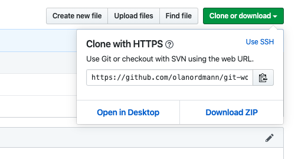

# Git-workshop med ProgSys

## Oppsett
### Installer git
**Mac:**  
```
$ brew install git
```
**Ubuntu:**  
```
$ sudo apt install git
```
**Windows:**  
Installer [Git BASH](https://gitforwindows.org/).

Sjekk at Git er installert ved å kjøre kommandoen:
```
$ git --version
```

### Opprette bruker på GitHub
Opprett en bruker på GitHub. Hvis du allerede har en bruker, trenger du så klart ikke å opprette en ny. 

Konfigurer Git til å være satt opp med GitHub-brukeren din:
```
$ git config --global user.name "Ola Nordmann"
$ git config --global user.email "ola.nordmann@mail.no"
```

---
Bra! Nå har du gjort mesteparten av standardoppsettet! Nå skal vi lage et lage et prosjekt som skal synkroniseres med GitHub!

## Ditt første repository
Nå vi jobber med Git og GitHub snakker vi ofte *repositories*, som er prosjektmapper. Disse repositoriene ser lokalt ut som vanlige mapper, men de har en submappe som heter `.git` - denne mappen inneholder en del informasjon som brukes til å synkronisere koden din med koden som ligger på GitHub. På GitHub ser repositories ut som prosjekter. 

For å opprette et nytt repository går vi inn i en mappe og bruker kommandoen `git init` - OBS. IKKE kjør denne kommandoen i hjem-mappen din! 
Test at du fikk til å opprette repositoriet ved å kjøre kommandoen `git status`.

<details><summary>💾 Løsningsforslag </summary>

1. Opprett en ny mappe
   ```
   $ mkdir git-workshop
   ```
2. Gå inn i mappen
   ```
   $ cd git-workshop
   ```
3. Kjør `git init`-kommandoen
   ```
   $ git init
   ```
4. Test at du har opprettet et repository ved å kjøre `git status`
   ```
   $ git status
   ```
   Output bør være noe ala dette:
   ```
   # On branch master
   #
   # Initial commit
   #
   nothing to commit (create/copy files and use "git add" to track)
   ```
   Legg merke til at vi er på grenene *master* - det er der hovedversjonen av prosjektet vårt bør ligge. Mer om dette senere!
</details>

## Dine første versjonshåndterte filer
Opprett en ny tekstfil med navn `info.txt` og skriv inn navnet og alderen din på hver sin linje i filen. Legg til denne versjonen av filen ved å bruke `git add filnavn`. Etter du har lagt til versjonen av filen må du bekrefte at de endringene du har lagt til, ved `git add`, skal forme en versjon av prosjektet. Dette gjør du ved kommandoen `git commit`. Når du legger til en versjon av prosjektet er det må du legge til en beskrivelse av hva som har blitt endret - dette kalles en *commit message*. Du kan legge til meldingen som et argument ved `git commit -m "Endringsbeskrivelse"` eller så kan du kjøre kun `git commit`, og standardterminalteksteditoren din vil åpnes.


<details><summary>💾 Løsningsforslag </summary>

Vi bruker [Vim](vim.org) som teksteditor i dette eksempelet, men du kan bruke hvilken som helst teksteditor du vil:)
1. Opprett filen og begynn redigeringe ved
   ```
   $ vim info.txt
   ```
2. Vi legger til linjene:
   ```
   Navn: Ola Nordmann
   Alder: 22
   ```
3. Lagre og lukk filen.
4. Ta en titt på statusen til repositoriet
   ```
   $ git status
   ```
   Output bør være noe ala dette:
   ```
   # On branch master
   #
   # Initial commit
   #
   # Untracked files:
   #   (use "git add <file>..." to include in what will be committed)
   #
   #	info.txt
   nothing added to commit but untracked files present (use "git add" to track)
   ```
   Legg merke til at det står at filen vår ikke blir "tracket" - vi må altså si ifra til git at endringen skal legges til.
5. Legg til versjonsendringen i filen ved
   ```
   $ git add info.txt
   ```
6. Ta en titt på statusen til repositoriet
   ```
   $ git status
   ```
   Output bør være noe ala dette:
   ```
   # On branch master
   #
   # Initial commit
   #
   # Changes to be committed:
   #   (use "git rm --cached <file>..." to unstage)
   #
   #	new file:   info.txt
   #
   ```
   Vi har nå lagt til alle filendringene våre, og vi er klare til å "commite".
7. Sett sammen alle filendringene til en ny versjon av prosjektet ved
   ```
   $ git commit -m "Persondata lagt til"
   ```
   Legg merke til at commit-meldingen beskriver hva vi har gjort.
8. Ta en titt på statusen til repositoriet
   ```
   $ git status
   ```
   Output bør være noe ala dette:
   ```
   # On branch master
   nothing to commit, working directory clean
   ```
</details>


## Synkronisering med GitHub
Nå har vi fått til å lage ny versjoner av prosjektet vårt, men vi har enda ikke synkronisert prosjektet vårt med GitHub.

Logg inn på GitHub og opprett et nytt repository med navn `git-workshop`.

<details><summary>💾 Løsningsforslag </summary>

1. Gå inn på GitHub og logg inn på brukeren din.
2. I øverste venstre hjørne skal det være en grønn knapp med teksten [*New*](https://github.com/new). Klikk på den.
3. Skriv inn `git-workshop` som *Repository name*.
4. Velg om repositoriet skal være privat eller public - vi setter det til å være privat.
5. Klikk på den grønne knappen med teksten *Create repository*.

</details>

Nå som vi har laget et repository på GitHub, må vi sette opp en forbindelse fra vårt lokale repository til repositoriet på GitHub.

Kopier lenken til repositoriet som står øverst på siden. (Pass på at HTTPS er huket av enn så lenge). Lenken bør være noe ala:
```
https://github.com/brukernavn/git-workshop.git
```
Sett denne til å være målet til det lokale Git-repositoriet ditt ved kommandoen:
```
$ git remote add origin https://github.com/brukernavn/git-workshop.git
```

For å sende endringene våre til GitHub-repositoriet må vi bruke `git push`. Når vi jobber med Git snakker vi ofte om *branches*, eller *grener* på godt norsk. Branches brukes til å enklere kunne både samarbeide og videreutvikle et prosjekt, uten at man "ødelegger" prosjektet. Vi har alltid en hovedbranch som heter *master* - Her vil vi gjerne ha en fungerende versjon av prosjektet/obligen osv. Når vi ønsker å legge til nye endringer i hovedbranchen er det ofte lurt å lage en ny branch som tar utgangspunkt i hovedbranchen. Når de nye endringene fungerer kan vi nemlig slå hovedbranchen sammen med den nye arbeidsbranchen vår! Mer om dette senere.
Siden GitHub ikke vet at vi har laget en ny branch med navn master (dette skjer automatisk når man kjører `git init`), må vi legge til noen ekstra argumenter når vi prøver å *pushe*. 


For å sende endringene til GitHub kjører vi:
```
$ git push -u origin master
```
Du vil nå bli spurt om å brukernavn og passord. Vi kan sette opp en SSH-nøkkel som gjør av vi slipper å skrive inn brukernavn og passord hver gang, men dette gjør vi under *Snacks*-seksjonen.

Vi skal nå kunne se filen vår på GitHub!

**Oppgave**  
Legg til enda en linje i `info.txt` for eksempel yndlingsfarge, og lag en commit med endringen før du synkroniserer versjonen med GitHub.

<details><summary>💾 Løsningsforslag </summary>

1. Åpne filen i teksteditoren din: f.eks. Vim:
   ```
   $ vim info.txt
   ```
2. Legg til linjen med f.eks. yndlingsfarge - filen bør nå se slik ut:
   ```
   Navn: Ola Nordmann
   Alder: 22
   Yndlingsfarge: Blå
   ```
   Lagre og lukk filen.
3. Legg til endringene i filen til versjonen:
   ```
   $ git add info.txt
   ```
4. Bekreft versjonen:
   ```
   $ git commit -m "Yndligsfarge lagt til"
   ```
5. Send endringene til GitHub:
   ```
   $ git push
   ```

</details>

Hvis man kun jobber alene, og ønsker å bruke GitHub og Git i hovedsak som backup, holder det å mer eller mindre kun bruke master. Videre skal vi se på hvordan vi kan bruke GitHub til å enkelt samarbeide med andre!

## Branches og Pull Requests

Vi skal nå se på hvordan vi enkelt kan holde styr på endringer og enklere kunne samarbeide med bruk av branches. Vi kan se en oversikt over branchene våre ved å kjøre:
```
$ git branch
```
Output bør være:
```
* master
```
Her ser vi at vi har én branch med navn `master`, og at det er den branchen vi er i - dette ser vi indikert ved `*`.

For å opprette en ny branch bruker vi:

```
$ git branch branch-name
```

Branchen som blir opprettet tar da utgangspunkt i den branchen du er på.

Og for å bevege oss mellom branches bruker vi
```
$ git checkout branch-name
```

**Oppgave**   
Lag en ny branch med navn `bosted` og hopp til den branchen. Legg deretter til en ny linje i `info.txt` med informasjon om bostedet ditt.


<details><summary>💾 Løsningsforslag </summary>

1. Opprett den nye branchen:
   ```
   $ git branch bosted
   ```
2. Sjekk at branchen har blitt opprettet ved:
   ```
   $ git branch
   ```
   Output bør være noe ala dette:
   ```
     bosted
   * master
   ```
   Legg merke til at vi fremdeles er på master-branchen.
3. Bytt til `bosted`-branchen ved:
   ```
   $ git checkout bosted
   ```
4. Sjekk at vi er på riktig branch ved:
   ```
   $ git branch
   ```
   Output bør nå være:
   ```
   * bosted
     master
   ```
5. Oppdater `info.txt` slik at den ser slik ut:
   ```
   Navn: Ola Nordmann
   Alder: 22
   Yndlingsfarge: Blå
   Bosted: Oslo
   ```
6. Legg til endringene og bekreft versjonen:
   ```
   $ git add info.txt
   $ git commit -m "Bosted lagt til"
   ```
7. Send endringene til GitHub. Her må vi huske at vi nå prøver å sende en ny branch, så da må vi huske å ha med `-u origin branchname`:
   ```
   $ git push -u origin bosted
   ```

</details>

På GitHub kan vi nå se at vi har to branches!  


Vi er nå så fornøyde med de nye endringene våre at vi ønsker å legge inn de nye endringene i `bosted`-branchen i hovedbranchen vår (`master`). Dette kan vi gjøre på GitHub ved å opprette en Pull Request. Klikk på knappen med teksten *New pull request*:


Velg hvilken branch du ønsker å legge til endringene fra og til. Vi skal legge til endringene fra `bosted` til `master`:

Legg merke til teskten som står i grønt; noen ganger er dette ikke tilfellet, og da må man gjøre litt manuelt arbeid for å gjøre det mulig å slå sammen branchene.

Vi legger så til noen kommentarer om hva vi har gjort, og så trykker vi på knappen med teksten *Create pull request*. Vi kan nå trykke på den grønne knappen med teksten *Merge pull request* eller så kan vi jobbe videre på branchen. Vi har ikke noe mer å legge til, så vi velger å merge. Det er også god skikk å slette branchen når man har merget den - så vi klikker nå på *Delete branch*.

Hvis vi åpner nå terminalen og flytter oss tilbake til `master`-branchen. Vi kan ta en titt på innholdet i `info.txt`-filen ved å bruke kommandoen:
```
$ cat info.txt
```
Output er nå
```
Navn: Ola Nordmann
Alder: 22
Yndlingsfarge: Blå
```
Vi har altså ikke informasjonen om bosted, til tross for at den ligger i master på GitHub. På samme måte som vi ikke hadde filene våre på GitHub før vi sendte oppdateringene til GitHub, har vi ikke endringe som har blitt gjort på GitHub før vi henter dem. Dette kan vi gjøre med 
```
$ git pull
```
Hvis vi nå tar en titt på filen, ser vi at vi har den oppdaterte versjonen:
```
$ cat info.txt

Navn: Ola Nordmann
Alder: 22
Yndlingsfarge: Blå
Bosted: Oslo
```

# Samarbeid

# Snacks


## SSH-nøkler
For å slippe å skrive inn brukernavn og passord hver gang du gjør noen som helst kommandoer som kommuniserer med GitHub, kan vi sette opp en SSH-nøkkel. 

1. Opprett nøkkel ved:
   ```
   $ ssh-keygen
   ```
   Du vil få noen spørsmål etter du har kjørt kommandoen - standardinnstillingene fungerer som regel supert for de fleste. Merk at hvis du legger til et passord, må du skrive inn dette hver gang nøkkelen brukes.  
   Du skal nå ha to filer i `~.ssh/` med navn `id_rsa` (private key) og `id_rsa.pub` (public key). Aldri last opp/del `id_rsa` - du skal kun laste opp/dele `id_rsa.pub`!
2. Åpne GitHub. Klikk på brukerikonet ditt i øverste høyre hjørne etterfulgt av *Settings*.
3. Naviger til *SSH and GPG keys*.
4. Klikk på den grønne knappen med teksten *New SSH key*.
5. Gi nøkkelen et navn som gir mening (f.eks. Olas MacBook Pro).
6. Kopiér innholdet i `.ssh/id_rsa.pub` og lim det inn i *Key*-feltet.

Nå har du opprettet en SSH-nøkkel og lagt den til på GitHub! For å bruke denne nøkkelen må vi velge å bruke SSH-protokollen i stedet for HTTPS når vi cloner repositoriet. Det enkleste er nå å gå inn på repositoriet vårt på GitHub. Klikk på den grønne knappen med teksten *Clone or download* velg deretter *Use SSH*. Kopiér lenken og bruk kommandoen
```
$ git clone git@github.com:brukernavn/git-workshop.git
```



# Oppsummering av kommandoer
- `git add filename` - Legg til fileversjonen i en ny versjon.
  - `git rm --cached filname` - Fjern den nye filversjonen fra versjonen (motsatt av `git add`).
- `git commit -m "Commit message"` - Bekreft alle filversjonene du har lagt til ved `git add` og form en ny versjon av repositoriet. Commit message-en brukes for å oppsummere endringene i denne versjonen.
- `git push` - Send endringer fra lokal PC til GitHub.
  - `git push -u origin branch-name` - Brukes etter du har opprettet en ny branch med commits som også skal legges til på GitHub.
- `git pull` - Hent endringer fra GitHub til lokal PC.
- `git clone https://github.com/brukernavn/git-workshop.git` - Brukes for å laste ned et repository.
- `git status` - Se status til det lokale repositoriet ditt.
- `git branch` - Se alle lokale branches.
- `git branch branch-name` - Opprett en ny branch.
- `git checkout branch-name` - Endre aktiv branch.
- `git merge branch-name` - Sett sammen den aktive branchen med gitt branch.